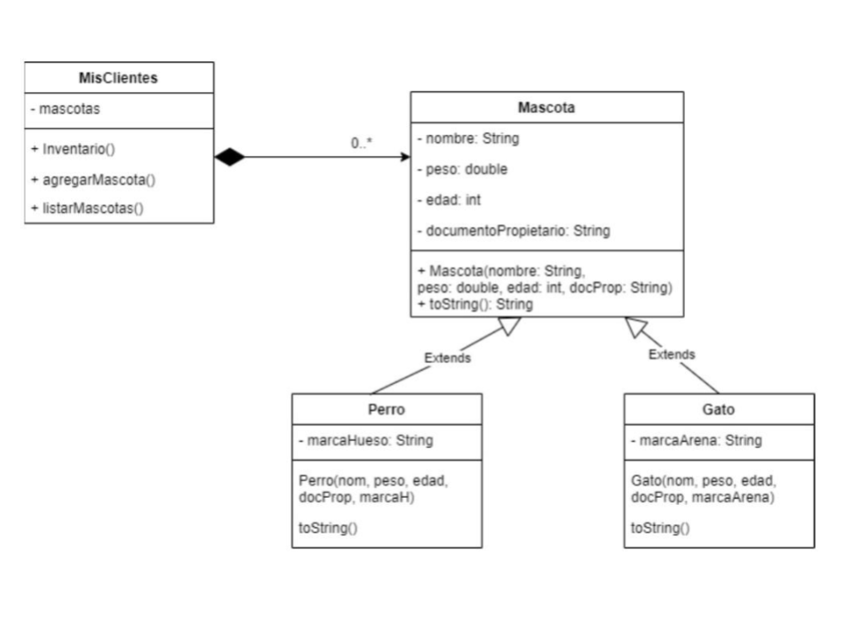

# Reto 2

## La tienda veterinaria Pooopis

El Dr. Stuart Pequeño quiere encomendarle el desarrollo de un pequeño demo de aplicación de la tienda y clínica veterinaria Pooopis. Se desea hacer un registro de todas las mascotas que pasan por la clínica. Para ello se define una clase llamada Mascota. Una Mascota tiene nombre, peso, edad y documento del propietario. Se tienen dos tipos de mascota: Perro y Gato. Si es perrito, se debe identificar la marca de hueso que consume. Si es Gato se debe registrar inicialmente la marca de arena de gato que consume.  
Considere la especificación del siguiente diagrama de clases para este reto:

</img>

### Procesar Comandos

En la clase MisClientes, se debe definir la función procesar comandos que realiza las siguientes operaciones:

- *Agregar Mascota: Opción 1*

    Se puede añadir un perrito el siguiente comando: 

    `1&Perro&nombre&peso&edadMeses&idDueño&marcaHueso`

    **Ejemplo:**

   ` 1&Perro&Max&12.3&48&18282727&Laikal`

    Se puede añadir un gatico con el siguiente comando:

    `1&Gato&nombre&peso&edadMeses&idDueño&marcaArena`

    **Ejemplo:**

    `1&Gato&Sam&4.1&26&1FB3CD&CanadaLitter`

- *Listar ítems del inventario: Opción 2*

    Se debe mostrar la frase: "\*\*\*Clientes***" Seguida por las mascotas en el orden en el que fueron agregadas.
    Si se trata de un Perro se mostrará así. Recuerde que `\t` implica correr el ítem unos espacios a la derecha:

    Nombre: Max  
        Peso: 12.3 kg  
        edad: 48 meses  
        documento: 18282727  
        Marca hueso: Laikal  

    Si se trata de un Gato se mostrará así:

    Nombre: Sam  
        Peso: 4.1 kg  
        edad: 26 meses  
        documento: 1FB3CD  
        Marca arena: CanadaLitter  

- *Salir: Opción 3*

**Nota 1:** Observe que el único comando que tiene salida es el listar.

**Nota 2:** En este ejercicio se requiere subir cuatro archivos. 

1. Uno correspondiente a las mascotas llamado **Mascota.java**

2. Otro correspondiente a perros particular llamado **Perro.java**

3. Otro correspondiente a gatos llamado **Gato.java**

4. Otro correspondiente al inventario de Clientes llamado **MisClientes.java** (aquí va el main)

Recuerde eliminar la línea de package al hacer el envío y utilizar el botón de [+] para agregar más de un archivo de código fuente. 

**Ejemplo:**

Un ejemplo de ejecución del programa es el siguiente:

|Entrada|Salida|
|-------|------|
|1&Perro&Max&12.3&48&18282727&Laikal||
|1&Gato&Sam&4.1&26&1FB3CD&CanadaLitter||
|2|\*\*\*Clientes***|
|3|Nombre: Max|     
||Peso: 12.3 Kg|   
||edad: 48 meses|
||documento: 18282727|
||Marca hueso: Laikal|
||Nombre: Sam|
||Peso: 4.1 Kg|
||edad: 26 meses|
||documento: 1FB3CD|
||Marca arena: CanadaLitter|