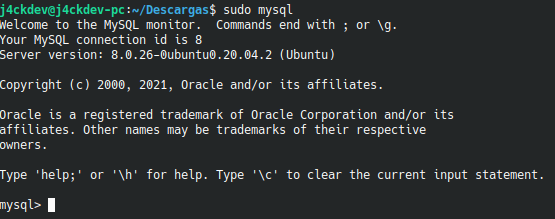
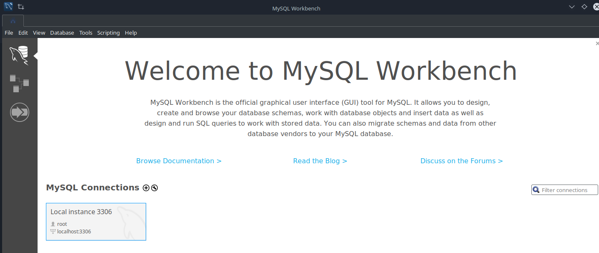
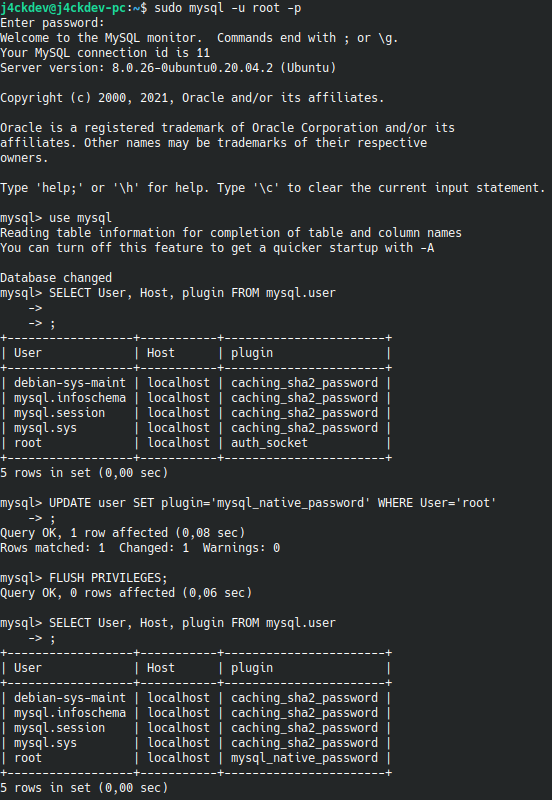
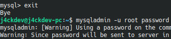
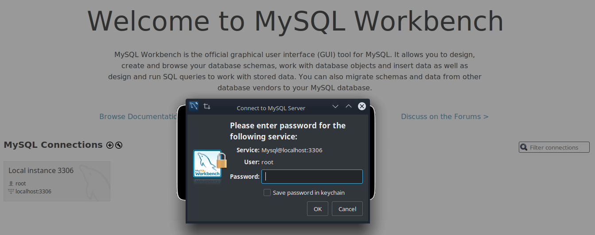
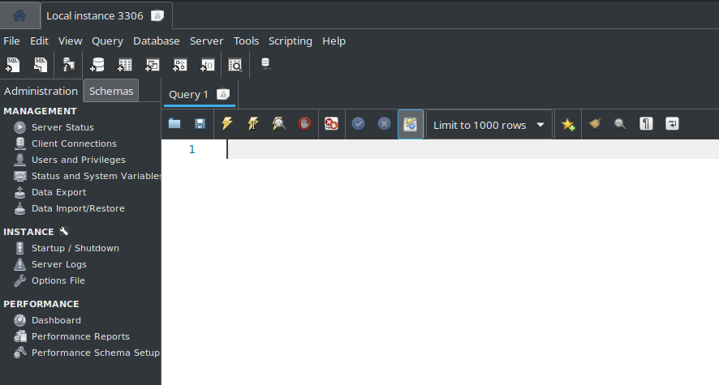

# Instalación de MySQL Workbench en Kubuntu
Para el desarrollo de los ejercicios de esta semana fue necesario instalar MySQL Workbench. Los pasos seguidos para su instalación desde el terminal son los siguientes:

1. Instalar el servidor de MySQL con el comando `sudo apt-get install mysql-server`.
2. Al finalizar la instalación, se debe ejecutar el comando `sudo mysql` para corroborar que la instalación se realizó correctamente. 
    
3. Para instalar la última versión de MySQL Workbench **8.0.26**, se debe descargar el instalador desde [MySQL Workbench](https://dev.mysql.com/downloads/workbench/), sino con el comando `sudo snap install mysql-workbench-community` se instala la versión **8.0.22**. En mi caso seleccioné la instalación por snap para mayor velocidad.
4. Si todo fue instalado correctamente, el programa deberá aparecer en la lista de aplicaciones del sistema y podrá abrirlo.
.
5. Lo siguiente es configurar el servidor de MySQL, para ello se ingresa el comando `sudo mysql -u root -p` y se ingresa la contraseña del superusuario (sudo).
6. Después se ejecutan los siguientes comandos:
    ```sql
    -- Accedemos a la base de datos de privilegios
    use mysql;
    -- Consultamos los datos de usuario de mysql
    SELECT User, Host, plugin FROM mysql.user;
    -- Actualizamos root para usar el método clásico de autenticación por contraseña
    UPDATE user SET plugin='mysql_native_password' WHERE User='root';
    -- Recarga la información con los cambios realizados sin reiniciar el servidor
    FLUSH PRIVILEGES;
    -- Consultamos de nuevo para comprobar que el cambio surtió efecto
    SELECT User, Host, plugin FROM mysql.user;
    ```
    Pantallazo de la configuración:
    
7. Con esto realizado, le damos exit. Cabe mencionar que el comando `sudo mysql -u root -p` solo se puede usar una vez, por lo que el siguiente paso es ejecutar el comando `mysqladmin -u root password tupassword` para cambiar la contraseña de root en MySQL.

    

    El pantallazo está recortado por seguridad, pero después de password debes colocar tu contraseña. Respecto al warning no hay problema de seguridad, ya que estamos configurando la base de datos en un entorno local, si el servidor fuera remoto, si sería necesario usar la conexión por SSH.

8. Luego, se deben ejecutar los siguientes comandos para darle permisos a MySQL Workbench y pueda conectarse a MySQL:
    ```bash
    snap connect mysql-workbench-community:password-manager-service
    snap connect mysql-workbench-community:ssh-keys
    ```
9. Por último se abre MySQL Workbench, se da click en **Local Instance 3306** y si pide la contraseña que configuraste anteriormente, la conexión a la base de datos fue exitosa.

    

    

### Notas
- Esta guía se realizó el día **17 de Agosto de 2021**, es posible que hayan nuevas versiones.
- La guía puede funcionar en otros derivados de Ubuntu.
- Esta guía fue basada en la guía de [Ángel Armando Estrada](https://platzi.com/tutoriales/1566-bd/8226-como-instalar-mysql-y-workbench-en-ubuntu-sin-morir-en-el-intento/).