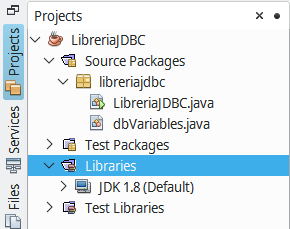
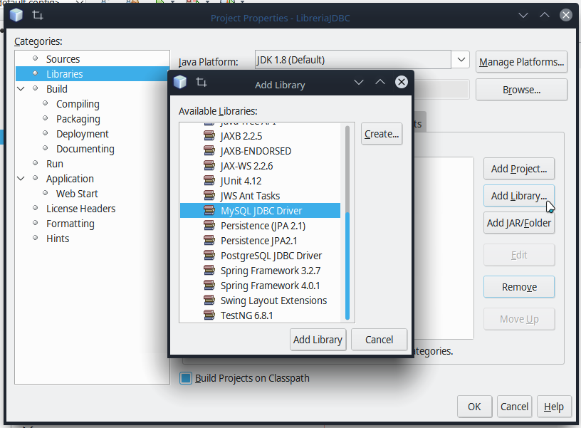
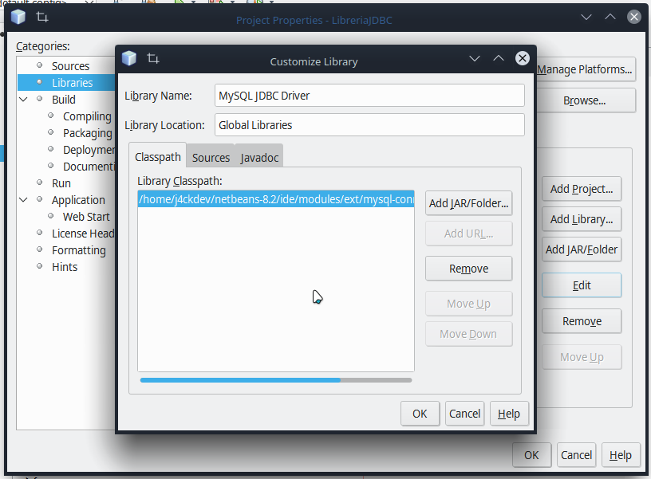

# Instalación de Connector/J 8.0.26 en Kubuntu
Para instalar el JDBC que nos permite conectar aplicaciones Java con MySQL 8, se deben seguir los siguientes pasos:
1. Descargar el conector desde [MySQL Connector](https://dev.mysql.com/downloads/connector/j/).
2. Instalar el archivo .deb con el comando `sudo dpkg -i mysql-connector-java_8.0.26-1ubuntu20.04_all.deb` o con el instalador de paquetes qapt.
3. Luego de la instalación, el archivo quedará instalado en `/usr/share/java/mysql-connector-java-8.0.26.jar`, cópielo y con Netbeans cerrado, péguelo en la carpeta `~/netbeans-8.2/ide/modules/ext/`. 
4. Abra Netbeans, cree un proyecto ejemplo para conectarse a MySQL, abra **Projects**, de clic derecho en **Libraries** y luego de clic en **Properties**. 

5. En la ventana **Properties**, de clic en **Add Library**, seleccione **MySQL JDBC Driver** y de clic en **Add Library**.  
    
6. Ahora con la librería importada se habilita el botón **Edit**, clic en el y en la ventana que aparece se elimina la referencia a `mysql-connector-java-5.1.23-bin.jar` con el botón **Remove**, se cambia por `mysql-connector-java-8.0.26.jar` mediante el botón **AddJAR/Folder** especificando la ubicación del archivo del paso 3 y se da clic en **Ok**.  
    
7. Por último, para comprobar que la librería funciona correctamente, copie el siguiente fragmento de código y coloque las credenciales y la base de datos a la que desea probar la conexión:
    ```java
    import java.sql.Connection;
    import java.sql.DriverManager;
    import java.sql.SQLException;

    // Este main colóquelo dentro de su clase o sino copie solo el contenido de este main al suyo
    public static void main(String[] args) {
        String dbURL = "jdbc:mysql://localhost:3306/tuBaseDeDatos";
        String username = "tuUsuario";
        String password = "tuPassword";
        try{
            Connection conn = DriverManager.getConnection(dbURL,username,password);
            if(conn != null){
                System.out.println("*** Conectado ***");
            }
        } catch (SQLException ex){
            ex.printStackTrace();
        }
    }